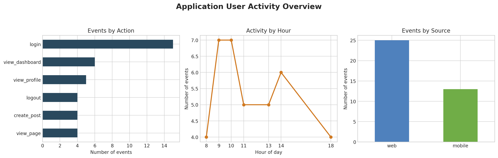

# Application User Activity Analysis

## Project overview

This project analyses application activity logs using Python and Pandas. The goal
is to understand how users interact with the application, identify the most
common actions, compare web and mobile activity, and determine peak engagement
hours.

The dataset contains 38 events from three users recorded between 1 and 7 October
2025. It is a small educational dataset, so the findings demonstrate the
analysis workflow rather than general behaviour across a large user population.

## Business questions

1. Which actions occur most frequently?
2. Which activities account for the most user time?
3. How does web activity compare with mobile activity?
4. At what hours is application activity highest?
5. Which users are the most active?

## Tools and techniques

- Python
- Pandas
- Matplotlib
- Data validation and cleaning
- Datetime feature engineering
- Mapping and categorisation
- Grouped aggregation
- Exploratory data analysis
- Data visualisation

## Dataset

The source file contains the following fields:

| Field | Description |
| --- | --- |
| `log_id` | Unique event identifier |
| `log_time` | Date and time of the event |
| `user_id` | User identifier |
| `action` | Action performed in the application |
| `duration_seconds` | Recorded duration of the action |
| `source` | Web or mobile platform |

Data-quality checks found no missing values and no duplicate rows.

## Key findings

- The dataset contains **38 events**, **3 users**, and **1,262 seconds** of
  recorded activity.
- `login` is the most frequent action with **15 events**.
- `create_post` accounts for the most recorded time: **690 seconds**, or about
  **55%** of total duration.
- Web generated **25 events** compared with **13 mobile events**.
- The highest event counts occur at **09:00 and 10:00**, with seven events in
  each hour.
- User `101` is the most active user with **16 events** and **671 seconds** of
  recorded activity.

Because the sample is small, these findings should be treated as descriptive
rather than representative of the full application user base.

## Visual summary



## Repository structure

```text
.
├── data/
│   └── app_logs.csv
├── images/
│   └── user_activity_dashboard.png
├── outputs/
│   ├── action_summary.csv
│   ├── hourly_summary.csv
│   ├── source_summary.csv
│   └── user_summary.csv
├── src/
│   └── user_activity_analysis.py
├── .gitignore
├── README.md
└── requirements.txt
```

## How to run the project

1. Clone or download the repository.
2. Install the required packages:

   ```bash
   pip install -r requirements.txt
   ```

3. Run the analysis:

   ```bash
   python src/user_activity_analysis.py
   ```

The script creates the summary tables in `outputs/` and saves the dashboard in
`images/`.

## Potential business recommendations

- Schedule important product messages or engagement campaigns around the
  observed morning activity window, subject to validation with a larger sample.
- Review the content-creation journey because `create_post` accounts for a large
  share of recorded time; the behaviour could reflect meaningful engagement or
  unnecessary friction.
- Compare web and mobile conversion outcomes in a larger dataset before making
  platform-investment decisions.

## Author

**Adina Dadaeva**  
Business Analytics student based in Singapore  
[LinkedIn](https://www.linkedin.com/in/adina-dadaeva-718b5033a/)
